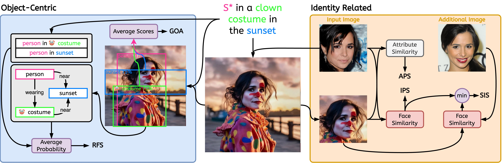

# STELLAR: Evaluation Metrics

Code for our paper:
[Stellar: Systematic Evaluation of Human-Centric Personalized Text-to-Image Methods](https://stellar-gen-ai.github.io/#authors)

Authors:
[Panos Achlioptas*](), [Alexandros Benetatos*](), [Iordanis Fostiropoulos*](https://iordanis.me), [Dimitris Skourtis*]()


The codebase is maintained by [Iordanis Fostiropoulos](https://iordanis.me). For any questions please reach out.

## Introduction


Note: "Input Image" and "Additional Image" shown are found in [CELEBMaksHQ](https://mmlab.ie.cuhk.edu.hk/projects/CelebA/CelebAMask_HQ.html) dataset.

This work is based on our technical manuscript [Stellar: Systematic Evaluation of
Human-Centric Personalized Text-to-Image Methods](). We proposed 5 metrics for evaluating human-centric personalization Text-2-Image models. The repository provides the implementation of 8 additional baseline metrics for Text-2-Image and Image-2-Image methods.

## Evaluation metrics

There are several metrics provided from literature. We denote with ⭐ the ones that are introduced by [our work](https://arxiv.org/abs/2312.06116).

We provide our own implementation of existing metrics and refer the user to their paper for the technical details of their work.

| Name  | Evaluation Type | Code Name | Reference |
| ------------- | ------------- | ------------- | ------------- |
| Aesth.  | Image2Image  | `aesth` | [Link](https://proceedings.neurips.cc/paper_files/paper/2022/hash/a1859debfb3b59d094f3504d5ebb6c25-Abstract-Datasets_and_Benchmarks.html)  |
| $CLIP_I$  | Image2Image  | `clip` | [Link](https://arxiv.org/abs/2103.00020)  |
| DreamSim  | Image2Image  | `dreamsim` | [Link](https://arxiv.org/abs/2306.09344)  |
|  |  |  |  |
| $CLIP_T$  | Text2Image  | `clip` | [Link](https://arxiv.org/abs/2103.00020)  |
| HPSv1  | Text2Image  | `hps` | [Link](https://arxiv.org/abs/2303.14420)  |
| HPSv2  | Text2Image  | `hps` | [Link](https://arxiv.org/abs/2306.09341)  |
| ImageReward  | Text2Image  | `im_reward` | [Link](https://arxiv.org/abs/2304.05977)  |
| PickScore  | Text2Image  | `pick` | [Link](https://arxiv.org/abs/2305.01569)  |
|  |  |  |  |
| APS ⭐ | Personalized Text2Image  | `aps` | [Link](https://arxiv.org/abs/2312.06116)  |
| GoA ⭐ | Object-centric  | `goa` | [Link](https://arxiv.org/abs/2312.06116)  |
| IPS ⭐  | Personalized Text2Image  | `ips` | [Link](https://arxiv.org/abs/2312.06116)  |
| ~RFS~* ⭐ | Relation-centric  | `rfs` | [Link](https://arxiv.org/abs/2312.06116)  |
| SIS ⭐  | Personalized Text2Image  | `sis` | [Link](https://arxiv.org/abs/2312.06116)  |

* RFS is currently pending merging to the current branch.

## Usage

```bash
pip install git+https://github.com/stellar-gen-ai/stellar-metrics.git
```

### 1. Compute the Metrics for each Image

We want to compute the metric for each individual image. As such it can help diagnose the failure cases of a method.


```bash
$ python -m stellar_metrics --metric code_name --stellar-path ./stellar-dataset --syn-path ./model-output --save-dir ./save-dir
```
*Optional* you can specify `--device`, `--batch-size` and `--clip-version` for the backbone

**NOTE** there must be one-to-one correspondance between model-output and stellar-dataset. The `stellar-dataset` is used to calculate some of the metrics, such as identity preservation where the original image is required. Misconfiguration between `syn-path` and `stellar-path` can lead to incorrect results.

#### Mock Example

Calculate IPS

```bash
$ python -m stellar_metrics --metric ips --stellar-path ./tests/assets/mock_stellar_dataset --syn-path ./tests/assets/stellar_net --save-dir ./save-dir
```

Calculate CLIP

```bash
$ python -m stellar_metrics --metric clip --stellar-path ./tests/assets/mock_stellar_dataset --syn-path ./tests/assets/stellar_net --save-dir ./save-dir
```

### 2. Produce Analysis Table


```bash
$ python -m stellar_metrics.analysis --save-dir ./save-dir
```

## [Starter Example](starter_notebook.ipynb)

##  Evaluating identity-centric qualities
### Identity Preservation

Assess the facial resemblance between the input identity and the generated images in a rather coarse but specialized way. Our metric uses a face detector to isolate the identity's face in both input and generated images. It then employs a specialized face detection model to extract facial representation embeddings from the detected regions.

### Attribute Preservation

Assess how well the generated images maintain specific fine-grained attributes of the identity in question, such as age, gender, and other invariant facial features (e.g.,~high cheekbones). Leveraging the annotations in Stellar images, we can evaluate these binary facial characteristics.

### Stability of Identity Score
Serves as a measure for determining the extent of a model's sensitivity to *different* images of the *same* individual; further promoting models where the subject's identity is consistently well-captured irrespective of the input's image irrelevant *variations* (e.g., lighting conditions, subject's pose).

To achieve this goal, `SIS` necessitates having access to multiple images of the human subject (a condition met in Stellar's dataset by design); and is our only evaluation metric with such a more demanding requirement.

## Object-centric Context Evaluation

### Object-centric Context Evaluation

We introduce specialized and interpretable metrics to evaluate two key aspects of the alignment between image and prompt; object representation faithfulness and the fidelity of depicted relationships.

### Relation Fidelity Score
Evaluate the success of representing the desired prompt object-interactions on the generated image. Considering the difficulty of even specialized Scene Graph Generation (SGG) models to understand visual relations, this metric introduces a valuable localized insight into the ability of the personalized model to faithfully depict the prompted relations.

## License

Before downloading or using any part or the code in this repository the propsective user acknowledges that they have read and agreed with the terms described in the license shown in [LICENSE](./LICENSE) and the Third Party License Terms shown in [THIRD-PARTIES](./THIRD-PARTIES-LICENSE).
